# Лабораторная работа №9

Часть 1

1. Команда показывает, что я на ветке main и некоторые файлы не отслеживаются

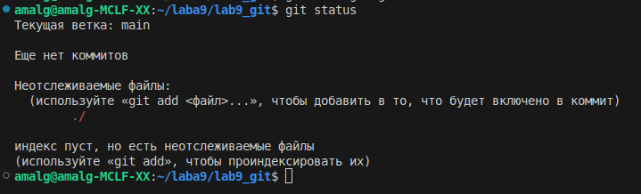

2.Пустой журнал коммитов

3.Создаем файл и закидываем туда функцию сортировки

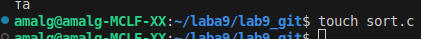 

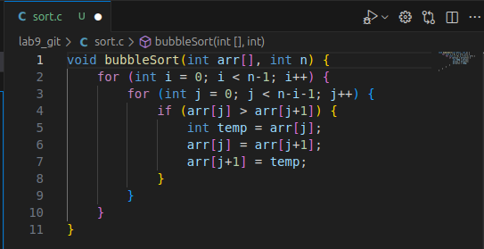

4. Некоторые файлы не отслеживаются

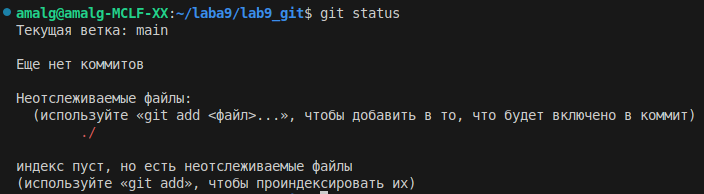

5-6. sort.c находится в подготовке к коммиту, а README.md не отслеживается

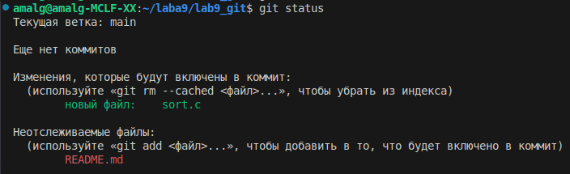

7.Коммитим файл в репо

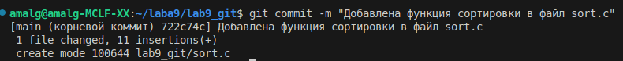

8. sort.c исчез из списка изменений, остался README.md

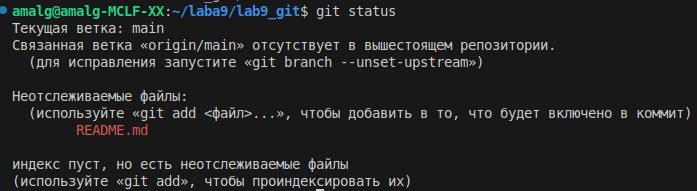

9.Добавляем в первую строку коммент

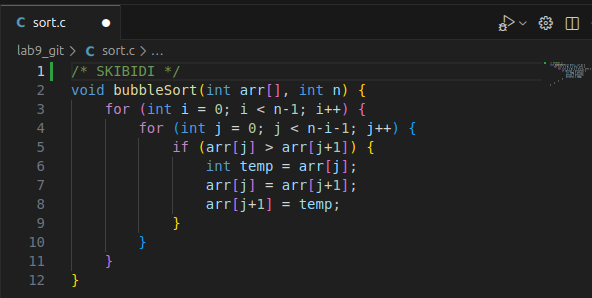

10.sort.c отображается как измененный

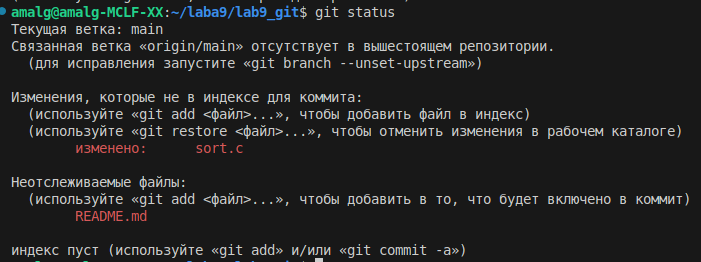

11-12. sort.c подготовлен к коммиту

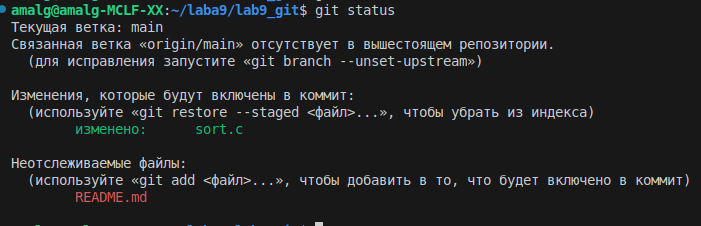

13. Добавляем коммент в конец файла
    

14. Коммитим его
    
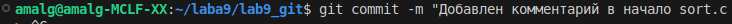

15. Статус покажет, что есть незаконченное изменение(второй коммент), а лог покажет 2 коммита

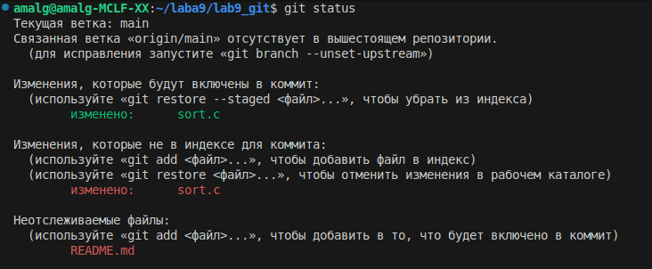 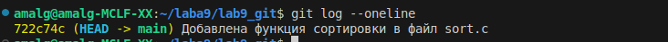

16. Добавляем и коммитим файл со вторым комментом

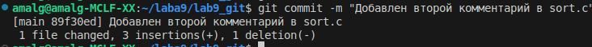

17. Пушим в удаленный репо

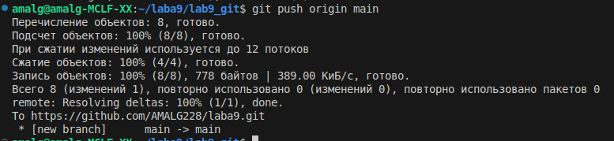 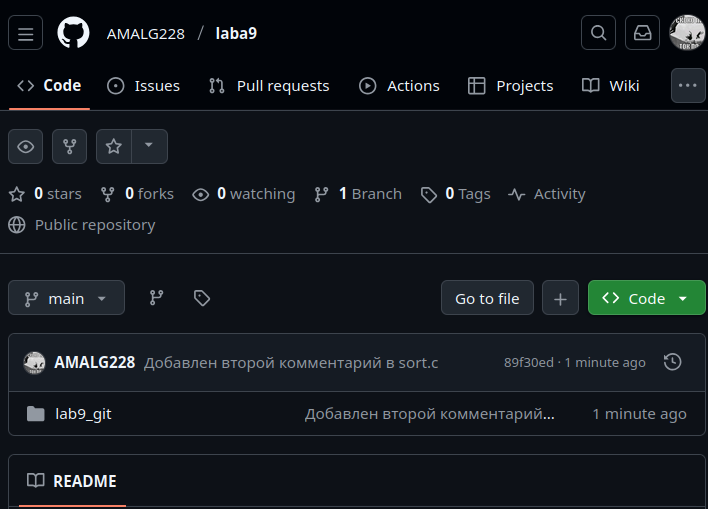

Часть 2

1. Создаем ветку mybranch

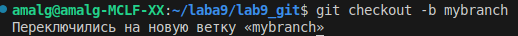

2. Смотрим на нее

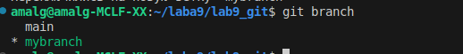

3. Прыгаем с ветки на ветку

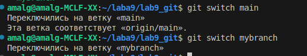

4. Смотрим статусы в разных ветках

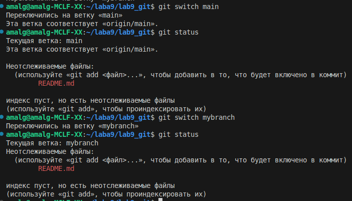

5. Убеждаемся, что на новой ветке

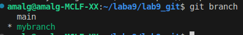

6. Создаем текст. файл со своим именем

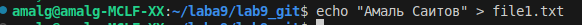

7. Добавляем и коммитим его

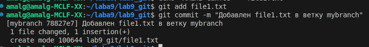

8. Наша ветка указывает на новый коммит

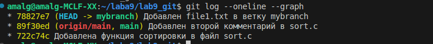

9. Прыгаем на ветку main

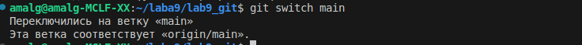

10. Коммит file1.txt исчез, потому что он на другой ветке

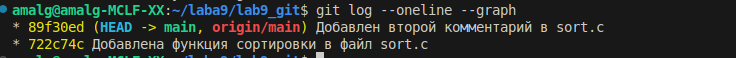

11. Создаем второй файл, добавляем и коммитим его

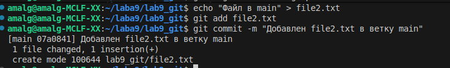

12. Видны две расходящиеся ветки

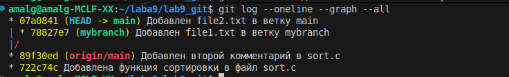

13. Прыгаем на ветку mybranch

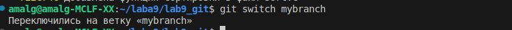

14. file2.txt нет, потому что он был создан в другой ветке

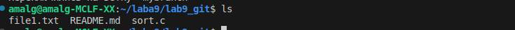

15. Команда показывает, что в main есть file2.txt, которого нет в mybranch, и наоборот

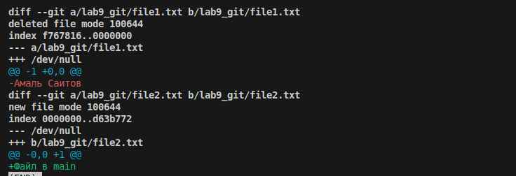

